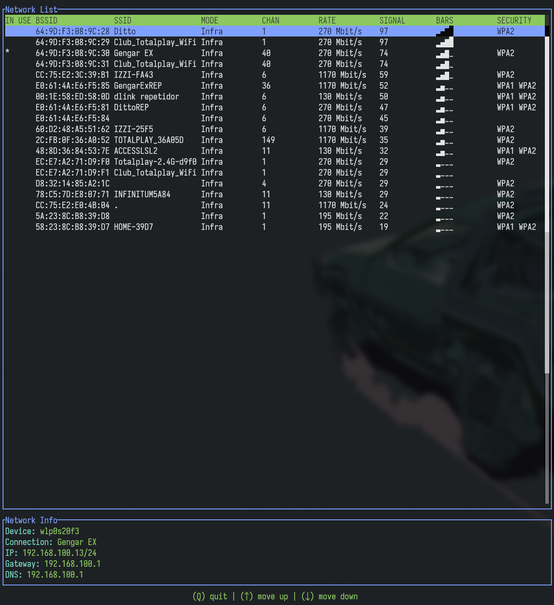

# Jeanette TUI

### Terminal application built with Rust and Ratatui for managing network connections on Linux using nmcli.

**Work in progress...**

Currents status
- Showing networks list
- Showing active connection info

